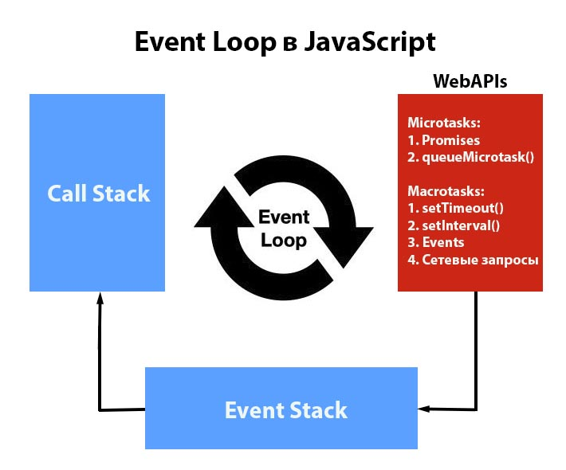

## Вопросы на собеседовании фронтенд разработчика React.js

Этот список содержит часто встречающиеся вопросы, которые задавали на собеседованиях на Frontend и JavaScript разработчиков, специализирующихся на использовании библиотеки React.

Вопросы и ответы на них в упорядочены в соответствии с частотой запросов. И удовлетворит большинство интервьюеров.

Тем не менее ожидается, что у вас есть опыт в верстке и программировании на JavaScript и React, достаточный для ответов на уточняющие вопросы. Конечно же, в процессе собеседований ответы дополнялись с учетом вопросов интервьюеров, но всегда нужно стремиться к лучшему:)

Вопросы по верстке расположены в конце списка так как сейчас основной упор делается на понимание JavaScript, React и общих принципов работы Web.

В конце важных и(или) сложных, на мой взгляд, блоков присутствуют ссылки для лучшего понимания и раскрытия темы.

**Если вам нравится материал или ответы и подсказки оказались полезными для вас, а возможно направили на нужный путь, можете поддержать меня. Благодарю и желаю удачи, путник!**

**<font color="darkorange">Общие вопросы, интернет, сети, протоколы, web-технологии</font>**

<details>
<summary> Из чего состоит <b>HTTP запрос</b></summary>
<div style="margin-left: 20px;">

---

1. _Метод_: определяет действие, которое клиент хочет выполнить на сервере. Например, GET - получить данные, POST - отправить данные на сервер.
2. _URL_: указывает на ресурс, к которому обращается клиент.
3. _Заголовки_: содержат метаданные о запросе, такие как тип содержимого, информацию о клиенте, информация об авторизации, информация кеширования и другие метаданные.
4. _Тело_: содержит данные, которые клиент хочет передать на сервер. Например, в случае POST-запроса тело может содержать форму данных.

В зависимости от метода запроса (GET, POST, PUT, DELETE и т.д.) и цели запроса, структура запроса может изменяться.

<i>Подробнее: <a href='https://selectel.ru/blog/http-request/' target="_blank">HTTP-запросы: структура, методы, строка статуса и коды состояния</a></i>

---

</div>
</details>

<details>
<summary> Различия между <b>HTTP 1/2 и 3</b></summary>
<div style="margin-left: 20px;">

---

_HTTP/1.1_

-   Потоковое взаимодействие: HTTP/1.1 использует по сути однопоточное соединение для передачи данных, что означает, что каждый запрос блокирует соединение, пока не получит ответ. Этот феномен называется "head-of-line blocking".
-   Соединения: Поддерживает многократные соединения, но они могут быть неэффективны из-за вышеупомянутого блокирования.
-   Заголовки: Передача заголовков не оптимизирована, требует многократного дублирования информации.

_HTTP/2_

-   Бинарный протокол: HTTP/2 использует бинарный формат вместо текстового, что позволяет более эффективно обрабатывать запросы и ответы.
-   Мультиплексирование: Позволяет одновременно отправлять несколько запросов и получать несколько ответов по одному соединению, что устраняет проблему head-of-line blocking.
-   Сжатие заголовков: Использует механизм HPACK для сжатия заголовков, что экономит пропускную способность и ускоряет передачу.
-   Приоритизация запросов: Поддерживает приоритизацию запросов, позволяя серверу определять, какой ответ важнее.

_HTTP/3_

-   Протокол QUIC: HTTP/3 основан на QUIC, который работает поверх UDP, а не TCP. Это позволяет избежать некоторых ограничений TCP, таких как задержки при установлении соединения.
-   Улучшенное мультиплексирование: QUIC устраняет проблемы head-of-line blocking не только на уровне запроса, но и на уровне соединения, так как травмы одного потока не влияют на другие.
-   Безопасность: QUIC изначально включает шифрование, что делает его более безопасным, чем предыдущие версии, где TLS добавляется опционально.
-   Скорость и производительность: Улучшенные механизмы работы с потерей пакетов и перенастройкой обеспечивают более высокую скорость загрузки страниц и более стабильное подключение.

**Выводы**

-   HTTP/2 и HTTP/3 значительно улучшают производительность по сравнению с HTTP/1.1, особенно при передаче больших объемов данных и множественных запросов.
-   HTTP/3 включает встроенную безопасность, в то время как для HTTP/1.1 и HTTP/2 необходимо использовать TLS.

Изменения в каждом из протоколов были направлены на устранение недостатков предыдущих версий и на обеспечение более высоких скоростей и надежности для современных веб-приложений.

<i>Подробнее: <a href='https://vc.ru/seo/442112-http-2-chto-eto-i-zachem-on-vam' target="_blank">HTTP/2: что это и зачем он вам</a></i>
<i>и еще: <a href='https://nuancesprog.ru/p/12982/' target="_blank">Что такое HTTP/3?</a></i>

---

</div>
</details>

<details>
<summary> <b>Методы HTTP</b>-запросов</summary>
<div style="margin-left: 20px;">

---

-   _GET_ - запрашивает представление ресурса. Запросы, использующие этот метод, могут получать только данные.
-   _HEAD_ - запрашивает ресурс так же, как и метод _GET_, но без тела ответа.
-   _POST_ - используется для отправки сущностей на определенный ресурс. Он часто приводит к изменению состояния или другим побочным эффектам на сервере.
-   _PUT_ - заменяет все текущие представления ресурса данными запроса.
-   _DELETE_ - удаляет указанный ресурс.
-   _CONNECT_ - устанавливает туннель к серверу, идентифицированному ресурсом.
-   _OPTIONS_ - используется для описания опций связи с ресурсом.
-   _TRACE_ - выполняет проверку обратного хода сообщения по пути к целевому ресурсу.
-   _PATCH_ - используется для частичной модификации ресурса.

---

</div>
</details>

<details>
<summary>Процесс <b>загрузки web-сайта</b></summary>
<div style="margin-left: 20px;">

---

1. _Ввод URL_: пользователь вводит адрес сайта (например, www.example.com) в адресной строке браузера и нажимает Enter.

2. _Проверка кэша_: браузер проверяет, был ли этот сайт загружен ранее и есть ли сохранённая версия в кэше. Если есть, он может загрузить страницу из кэша, ускоряя процесс.

3. _Разрешение доменного имени_: если запрашиваемый домен уже посещался ранее и находится в кэше браузера, он использует кэшированное значение. Это позволяет избежать лишних запросов к DNS-серверам и ускоряет процесс загрузки. Если адреса нет в кэше браузера, проверяется системный кэш операционной системы.
   Если и там совпадения не найдено, браузер отправляет DNS-запрос на указанный сервер. Этот запрос служит для преобразования доменное имя в соответствующий IP-адрес, необходимый для установления соединения с сервером.
   DNS-сервер обрабатывает запрос и, если он находит соответствующий IP-адрес, отправляет его обратно в браузер.

4. _Установление соединения_: браузер использует протокол TCP для установления соединения с сервером по полученному IP-адресу. Это может включать процесс трёхстороннего рукопожатия (SYN, SYN-ACK, ACK).
   Если сайт использует HTTPS, устанавливается также защищённое TLS-соединение для шифрования данных.

5. _Отправка HTTP-запроса_: после установки соединения браузер отправляет HTTP-запрос на сервер, запрашивая необходимую страницу (например, метод GET для получения данных).

6. _Обработка запроса сервером_: сервер принимает запрос, обрабатывает его и формирует ответ. Это может включать взаимодействие с базой данных, выполнение серверного кода и сбор данных.

7. _Отправка HTTP-ответа_: сервер отправляет обратно HTTP-ответ, который может включать HTML-код, изображения, CSS и JavaScript файлы. Ответ содержит статусный код (например, 200 OK для успешного запроса или 404 Not Found для несуществующей страницы).

8. _Получение и обработка данных_: браузер получает ответ и начинает обрабатывать HTML-код. Он анализирует структуру документа и идентифицирует ресурсы (изображения, CSS, JavaScript), которые также нужно загрузить.

9. _Дополнительные запросы_: браузер отправляет дополнительные HTTP-запросы для загрузки внешних ресурсов, таких как стили (CSS) и скрипты (JavaScript). Это может происходить параллельно для ускорения процесса.

10. Далее происходит _процесс рендеринга страницы_, который описан ниже.

<i>Подробнее: <a href='https://www.reg.ru/blog/chto-proishodit-kogda-my-otkryvaem-sajt-v-brauzere/' target="_blank">Что происходит, когда вы вбиваете доменное имя в браузере</a></i>

---

</div>
</details>

<details>
<summary> Процесс <b>рендеринга страницы</b></summary>
<div style="margin-left: 20px;">

---

1. _Парсинг HTML_: браузер загружает HTML-код, анализирует и создает структуру DOM.
2. _Загрузка CSS_: браузер загружает внешние CSS-файлы и применяет стили к элементам DOM.
3. _Вычисление стилей_: браузер вычисляет свойства стилей для каждого элемента и обновляет DOM.
4. _Размещение элементов_: браузер определяет положение каждого элемента на странице, учитывая их размеры и стили.
5. _Отображение элементов_: после определения положения элементов браузер отрисовывает их на экране.

События _onload_ и _DOMContentLoaded_:

_DOMContentLoaded_:

-   Событие срабатывает, когда весь HTML был полностью загружен и разобран, без ожидания стилей, изображений и других ресурсов.
-   Это означает, что DOM построен и готов к взаимодействию с JS, но внешние ресурсы (например, стили, изображения) могут ещё загружаться.

_onload_:

-   Событие происходит, когда весь контент (включая стили, изображения, и прочие ресурсы) был полностью загружен.
-   Обычно это использовалось для выполнения дополнительных действий после полной загрузки страницы, таких как инициализация скриптов или отображение динамически загружаемых элементов.

<i>Подробнее: <a href='https://doka.guide/tools/how-the-browser-creates-pages/' target="_blank">Как браузер рисует страницы</a></i>

---

</div>
</details>

<details>
<summary>Что означает <b>CORS</b>, какую проблему решает?</summary>
<div>

---

Нужно понимать что CORS это стандарт веб-безопасности, который реализован в браузерах для защиты пользователей от некоторых типов атак, таких как Cross-Site Scripting (XSS)

(CORS) предоставляет веб-серверам возможность контролировать междоменные запросы и производить безопасный обмен данными между разными доменами.

Как работает CORS:

Когда веб-страница пытается сделать запрос к ресурсу, находящемуся на другом домене или на другом порту, браузер сначала отправляет предварительный запрос (preflight request) с помощью метода OPTIONS, чтобы проверить, разрешает ли сервер такой доступ.

-   Если сервер настроен правильно и отвечает с соответствующими заголовками (например, Access-Control-Allow-Origin), браузер разрешает выполнение фактического запроса.
-   Если сервер не разрешает доступ, браузер блокирует запрос и предотвращает доступ к ресурсу.

Обойти правила CORS можно:

-   используя прокси-сервер. В данном случае клиент отправляет запрос к своему же серверу, который затем пересылает запрос к нужному серверу. Однако, этот подход имеет свои недостатки, такие как дополнительная нагрузка на сервер и увеличение задержки.

-   используя расширения браузера, таких как CORS Everywhere или установка заголовков браузера для временного отключения CORS. Эти методы могут использоваться в целях разработки или тестирования, но не следует использовать их в продакшене

Наиболее правильным способом решения проблем CORS является настройка сервера, чтобы он правильно обрабатывал запросы с других источников через использование заголовков CORS.

<i>Подробнее: <a href='https://habr.com/ru/companies/macloud/articles/553826/' target="_blank">CORS для чайников</a></i>

---

</div>
</details>

<details>
<summary> <b>Хранилища данных</b> в браузере</summary>
<div style="margin-left: 20px;">

---

-   _Куки (Cookies)_: используются для хранения небольших данных и имеют ограничения по размеру и количеству.
-   _Сессионное хранилище (LocalStorage)_: сохраняет данные на протяжении одной сессии браузера.
-   _Локальное хранилище (SessionStorage)_: предоставляет возможность сохранять данные на длительный срок.

Выбор между этими методами зависит от потребностей приложения по хранению, обновлению и доступу к данным.

<i>Подробнее: <a href='https://webformyself.com/varianty-xraneniya-dannyx-v-brauzere-v-2021-godu/' target="_blank">Варианты хранения данных в браузере</a></i>

---

</div>
</details>

<details>
<summary> Способы <b>уменьшения времени загрузки</b> страницы</summary>
<div style="margin-left: 20px;">

---

-   минимизация количества запросов.
-   lazy-loading.
-   минификация CSS и JS.
-   оптимизация изображений.
-   использование кеширования.

---

</div>
</details>

<details>
<summary> Как узнать <b>версию браузера</b> пользователя?</summary>
<div style="margin-left: 20px;">

---

Можно получить информацию о версии браузера пользователя с помощью объекта _navigator_ в JS.

```javascript
const browserVersion = navigator.userAgent;
console.log(browserVersion);
```

Предпочтительнее использовать сторонние библиотеки, такие как _platform.js_ или _Bowser_, так как информация о браузере может быть изменена или скрыта пользовательскими расширениями или настройками браузера.

---

</div>
</details>

</br>

**<font color="darkorange">Вопросы по JavaScript</font>**

<details>
<summary><b>Типы данных</b> в JS, <b>объект-обертка</b></summary>
<div style="margin-left: 20px;">

---

Всего в JS 8 типов данных:

-   Число (number)
-   Строка (string)
-   Булевый (логический) тип (boolean)
-   BigInt
-   Symbol
-   null
-   undefiend
-   Object

Механизм объекта-обертки

Когда мы работаем с примитивами, JS автоматически создает объекты-обертки, чтобы предоставить нам доступ к методам и свойствам, связанным с этими примитивами. В JS для каждого из примитивных типов создается свой собственный объект-обертка.

Объекты-обертки в JS позволяют использовать методы и свойства, как если бы мы работали с объектами, но при этом все примитивы остаются не изменяемыми и эффективными. Это добавляет удобство, позволяя работать с примитивами в объектах без их непосредственного изменения.

---

</div>
</details>

<details>
<summary> Строгое и не строгое <b>равенство</b></summary>
<div style="margin-left: 20px;">

---

1.  Строгое равенство _(===)_ проверяет, равны ли два значения и имеют ли они одинаковый тип данных.

```javascript
console.log(1 === '1'); // false, потому что 1 - число, а '1' - строка
console.log('1' === '1'); // true, потому что обе строки равны
```

2.  Нестрогое равенство _(==)_ сравнивает значения (которые приводяться к числу), но не учитывает тип данных.

```javascript
console.log(1 == '1'); // true, потому что JS преобразует строку '1' в число 1 для сравнения
console.log('1' == '1'); // true, оба значения уже являются строками
```

В строгом сравнении значения приводяться к строке, в не строгом к числу

---

</div>
</details>

<details>
<summary>Какие значения в JS являются <b>ложными</b>?</summary>
<div style="margin-left: 20px;">

---

В JS ложными являются значения, которые, при преобразовании их к логическому типу, становятся значениями _false_

-   ''
-   0
-   null
-   undefined
-   NaN
-   false

---

</div>
</details>

<details>
<summary>  <b>Spread</b>-оператор и <b>rest</b>-оператор<b></b></summary>
<div style="margin-left: 20px;">

---

_spread_-оператор (...):

-   распространяет элементы массива или свойства объекта.

-   используется для создания нового массива или объекта, содержащего элементы или свойства исходного массива или объекта.

-   распаковывает элементы массива или свойства объекта, позволяя передавать их в другие функции или объединять с другими массивами или объектами.

```jsx
const numbers = [1, 2, 3];
const newArray = [...numbers, 4, 5];
console.log(newArray); // Выведет: [1, 2, 3, 4, 5]
```

_rest_-оператор (...):

-   собирает оставшиеся аргументы функции в массив.

-   используется для объявления параметра функции, который будет содержать все оставшиеся аргументы, переданные при вызове функции.

```jsx
function sum(...numbers) {
    return numbers.reduce((acc, num) => (acc += num));
}
console.log(sum(1, 2, 3, 4, 5)); // Выведет: 15
```

<i>Подробнее: <a href='https://stackdev.blog/blog/spread-rest-operator' target="_blank">Операторы Spread и Rest в JS ES6</a></i>

---

</div>
</details>

<details>
<summary><b>Поднятие</b> переменных и функций (<b>hoisting</b>)</summary>
<div style="margin-left: 20px;">

---

Поднятие переменных и функций (hoisting) — это перемещение их объявлений в верхнюю часть их области видимости (глобальной области видимости или области видимости функции).

```jsx
console.log(x); // Выведет: undefined
var x = 5;
```

Объявление переменной _x_ поднимается в начало своей области видимости, поэтому _console.log(x)_ не вызовет ошибку, но вернет _undefined_, так как присвоение значения происходит позже.

```jsx
greet(); // Вызов функции до объявления
function greet() {
    console.log('Привет!');
}
```

Этот код работает, потому что определение функции _greet_ поднимается в начало области видимости.

-   Поднятие переменных работает для _var_, но не для _let_ и _const_. Переменные _let_ и _const_ остаются в "зоне видимости" до фактического объявления, что исключает доступ к ним до этого момента.
-   Хотя объявления функций поднимаются вверх, это не относится к функциональным выражениям.

<i>Подробнее: <a href='https://college.arthur-nesterenko.dev/javascript/hoisting' target="_blank">Всплытие переменных и функций</a></i>

---

</div>
</details>

<details>
<summary>Что такое <b>цикл событий</b> (event loop) и как он работает?</summary>
<div style="margin-left: 20px;">

---

По сути бесконечный цикл. Механизм, используемый JS для управления асинхронным кодом. В контексте браузера или среды выполнения JS, такой как Node.js, Event Loop отвечает за обработку событий и выполнение колбэков в определенном порядке.

-   Однопоточность: JS является однопоточным, что означает выполнение только одной задачи за раз. Event Loop помогает управлять многозадачностью и асинхронным кодом.

-   _Стек вызовов (Call Stack)_: здесь хранятся функции, которые должны быть выполнены в данный момент. JS выполняет функции из стека по порядку. Если стек пустой, браузер переходит к выполнению задач из очереди событий.

-   _Очередь событий (Event Queue)_: здесь хранятся события и колбэки, ожидающие выполнения. Когда асинхронная операция завершается, ее колбэк помещается в очередь событий.

-   _Микрозадачи (Microtasks)_: специальный тип задач, выполнение которых происходит до событий в очереди. Промисы (Promise) являются примером микрозадач. Они обрабатываются до перехода к выполнению следующего элемента в очереди.

-   _Макрозадачи (Macrotasks)_: более общая категория задач, которые выполняются в основном цикле событий JS. Макрозадачи включают в себя такие операции, как обработка событий, выполнение таймеров (_setTimeout, setInterval_) и запросы к сети. Они обрабатываются после всех микрозадач в текущем цикле событий. Когда выполняется одна макрозадача, JS переходит к обработке всех доступных микрозадач, прежде чем вернуться к следующей макрозадаче. Таким образом, макрозадачи являются менее приоритетными по сравнению с микрозадачами, и их выполнение происходит лишь после завершения всех микрозадач.



Процесс:

-   Сначала выполняется синхронный код. Он помещается в Call Stack и выполняется до тех пор, пока не закончатся все синхронные операции.
-   Когда Call Stack пуст, Event Loop переходит к Event Queue и проверяет, есть ли там колбэки, готовые к выполнению.
-   Он перемещает один колбэк из Event Queue в Call Stack и выполняет его. Этот процесс повторяется, пока в очереди есть колбэки.

В целом, Event Loop в JS обеспечивает механизм выполнения асинхронного кода и организацию обработки событий так, чтобы приложение работало плавно и без блокировок.

<i>Подробнее: <a href='https://habr.com/ru/companies/hexlet/articles/656003/' target="_blank">Цикл событий и стек вызовов в JavaScript</a></i>

---

</div>
</details>

<details>
<summary>Что такое <b>замыкание</b>?</summary>
<div style="margin-left: 20px;">

---

Замыкание позволяет функции сохранять доступ к переменным из своего лексического контекста даже после завершения выполнения этого контекста. Это означает, что функция может "замкнуть" (захватить) переменные из внешней области видимости, сохранить их и использовать позже, даже если область видимости, где эти переменные были определены, уже не существует.

```jsx
function outerFunction() {
    const outerVariable = 'Я внешняя переменная';

    function innerFunction() {
        console.log(outerVariable); // innerFunction замкнула outerVariable
    }

    return innerFunction;
}

const innerFunc = outerFunction();
innerFunc(); // Выведет: Я внешняя переменная
```

<i>Подробнее: <a href='https://thedvlpr.gitbook.io/javascript-for-dummies/zamykaniya' target="_blank">Замыкания</a></i>

---

</div>
</details>

<details>
<summary>Что такое <b>прототип</b> объекта в JavaScript?</summary>
<div style="margin-left: 20px;">

---

Прототип объекта в JS является механизмом, который используется для разделения свойств и методов между объектами. В JS каждый объект имеет ссылку на свой "прототип" - другой объект, который выступает в качестве шаблона для этого объекта.

Когда мы обращаетемся к свойству или методу объекта, и это свойство или метод отсутствует в самом объекте, JS автоматически ищет его в прототипе этого объекта. Это создает цепочку прототипов, известную как "цепочка прототипов" или "цепочка наследования". Этот механизм делает возможным наследование и повторное использование кода в JS.

<i>Подробнее: <a href='https://thedvlpr.gitbook.io/javascript-for-dummies/prototipy' target="_blank">Прототипы</a></i>

---

</div>
</details>

<details>
<summary>Как работает ключевое слово <b>this</b>?</summary>
<div style="margin-left: 20px;">

---

_this_ в JS используется для ссылки на текущий объект, в контексте которого выполняется код. Значение _this_ зависит от того, как вызывается функция.

1. В глобальном контексте _this_ ссылается на глобальный объект (_window_ в браузере, _global_ в Node.js).

2. Внутри функций значение _this_ зависит от того, как вызывается функция:

    - Неявное связывание (Implicit Binding): _this_ привязывается к объекту, в контексте которого была вызвана функция.
    - Явное связывание (Explicit Binding): Вы можете явно указать значение _this_ с помощью методов _call_, _apply_ или _bind_.
    - new Binding: При использовании конструкторов (с оператором new) _this_ ссылается на новый экземпляр объекта.

3. В стрелочных функциях значение _this_ заимствуется из окружающего лексического контекста.

<i>Подробнее: <a href='https://thedvlpr.gitbook.io/javascript-for-dummies/this-call-apply-bind' target="_blank">this, call, apply, bind</a></i>

---

</div>
</details>

<details>
<summary>Методы <b>apply()</b>, <b>call()</b> и <b>bind()</b></summary>
<div style="margin-left: 20px;">

---

Используются для управления значением this в функциях.

1. _call()_:
    - call() вызывает функцию с указанным значением this и аргументами, переданными в виде списка.
    - Синтаксис: function.call(thisArg, arg1, arg2, ...).
    - thisArg - значение this, которое будет использоваться во время выполнения функции.
    - arg1, arg2, и т.д. - аргументы, которые будут переданы в вызываемую функцию.

```jsx
function greet(message) {
    console.log(message + ' ' + this.name);
}

let person = {name: 'Алекс'};

greet.call(person, 'Привет,'); // Выведет 'Привет, Алекс'
```

2. _apply()_:
    - apply() вызывает функцию с указанным значением this и аргументами, переданными в виде массива.
    - Синтаксис: function.apply(thisArg, [arg1, arg2, ...]).

```jsx
function introduce(greeting, city) {
    console.log(greeting + ' я ' + this.name + ' из ' + city);
}

let person = {name: 'Алекс'};

introduce.apply(person, ['Привет,', 'Москвы']); // Выведет: 'Привет, я Алекс из Москвы'
```

3. _bind()_:

    - bind() создает новую функцию, привязанную к указанному значению this, не вызывая ее.
    - Синтаксис: function.bind(thisArg[, arg1[, arg2[, ...]]]).
    - thisArg - значение this, которое будет привязано к новой функции.
    - arg1, arg2, и т.д. - аргументы, которые будут фиксированы при вызове привязанной функции.

```jsx
function logFullName() {
    console.log(this.firstName + ' ' + this.lastName);
}

let person = {
    firstName: 'Алекс',
    lastName: 'Грей',
};

let logPersonName = logFullName.bind(person);
logPersonName(); // Выведет: 'Алекс Грей'
```

<i>Подробнее: <a href='https://thedvlpr.gitbook.io/javascript-for-dummies/this-call-apply-bind' target="_blank">this, call, apply, bind</a></i>

---

</div>
</details>

<details>
<summary>Что такое <b>Promise</b> (Промис)?</summary>
<div style="margin-left: 20px;">

---

Это объект в JS, представляющий результат асинхронной операции, которая может быть выполнена или отклонена (resolved или rejected) в будущем

1. Состояния промисов:
    - Промис может быть в одном из трех состояний: ожидание _(pending)_, выполнено _(fulfilled)_ или отклонено _(rejected)_.
    - В начале, когда создается промис, он находится в состоянии ожидания. После выполнения асинхронной операции его состояние меняется на выполненное или отклоненное.
2. Методы промисов:
    - _then()_: Используется для указания действий, которые должны быть выполнены после выполнения промиса.
    - _catch()_: Используется для обработки ошибок, которые возникли при выполнении промиса.
    - _finally()_: Позволяет выполнить определенные действия независимо от того, был ли промис выполнен или отклонен
    - _Promise.all([])_: возвращает промис, который завершится успешно, если массив промисов завершится успешно.
    - _Promise.allSettled([])_: ждёт выполнения всех промисов, при этом неважно, завершились они успешно или с ошибкой.
    - _Promise.race([])_: Возвращает промис, который завершится, когда первый промис из перечисленных завершится.
    - _Promise.any([])_: Возвращает промис, который завершится, когда первый промис из перечисленных завершится успешно.

```jsx
const promise = new Promise((resolve, reject) => {
    // Асинхронная операция (например, запрос к серверу)
    let success = true;

    if (success) {
        resolve('Успех!');
    } else {
        reject('Ошибка');
    }
});

promise
    .then((result) => {
        console.log(result); // Выведет 'Успех!' если промис выполнен или иначе success = true
    })
    .catch((error) => {
        console.log(error); // Выведет 'Ошибка' если промис отклонен или иначе success = false
    });
```

Позволяют избежать "callback hell" (англ. "ад callback'ов"), когда несколько асинхронных операций выполняются одна за другой, делая код трудным для поддержки и отладки.

<i>Подробнее: <a href='https://thedvlpr.gitbook.io/javascript-for-dummies/promises-obeshaniya' target="_blank">Promises (Обещания)</a></i>

---

</div>

</details>

<details>
  <summary>Особенности <b>async</b> и <b>await</b> </summary>
  <div style="margin-left: 20px;">

---

_async_ и _await_ - редоставляют возможность работы с промисами удобным и синхронным способом

-   _async_: используется для определения функции, которая выполняется асинхронно. Функция, помеченная как async, всегда возвращает промис.

-   _await_: используется внутри функции, объявленной как _async_, для приостановки выполнения асинхронной функции и ожидания результата разрешенного промиса перед продолжением выполнения функции. Ключевое слово _await_ можно использовать только внутри другой функции, объявленной как _async_.

Комбинация _async/await_ упрощает асинхронный код, делая его более читаемым и управляемым, поскольку вы можете использовать синтаксис, который похож на синхронный код, при работе с асинхронными операциями

<i>Подробнее: <a href='https://learn.javascript.ru/async-await' target="_blank">Async/await</a></i>

---

</div>
</details>

<details>
<summary>Коллекции <b>Map</b>,<b>Set</b></summary>

<div style="margin-left: 20px;">

---

_Map_ – коллекция для хранения записей вида _ключ:значение_. В отличие от объектов, в которых ключами могут быть только строки, в _Map_ ключом может быть произвольное значение. Элементы в _Map_ хранятся в порядке их вставки, и это обеспечивает предсказуемый порядок при итерации по ним. Для обхода элементов _Map_ можно использовать циклы

```jsx
let myMap = new Map();

myMap.set('key1', 'значение1');
myMap.set('key2', 'значение2');

console.log(myMap.get('key1')); // Выведет 'значение1'

myMap.forEach((value, key) => {
    console.log(key + ' = ' + value);
});
```

_Set_ – коллекция для хранения множества значений, причём каждое значение может встречаться только один раз. Допустим, у нас есть приходящие посетители, и нам нужно вести учёт уникальных посещений, чтобы избежать дублирования. В данном случае, применение структуры данных типа _Set_ идеально подходит: каждый посетитель будет учтён только один раз.

```jsx
let mySet = new Set();

mySet.add('значение1');
mySet.add('значение2');
mySet.add('значение1');

console.log(mySet.size); // Выведет 2, так как дубликат 'значение1' был проигнорирован

mySet.forEach((value) => {
    console.log(value);
});
```

Использование _Map_ и _Set_ удобно для хранения уникальных значений и реализации алгоритмов, требующих проверки наличия элемента или связи между ключами и значениями. _Map_ хорошо подходит для сохранения пар ключ-значение, в то время как _Set_ удобен для работы с уникальными элементами коллекции.

---

</div>
</details>

<details>
<summary> Как <b>сравнить 2 объекта</b>?</summary>
<div style="margin-left: 20px;">

---

Можно сравнить с использованием _JSON.stringify()_. Метод преобразует оба объекта в строки. Далее нужно просто их сравнить:

```jsx
const obj1 = {a: 1, b: 2};

const obj2 = {a: 1, b: 2};

console.log(JSON.stringify(obj1) === JSON.stringify(obj2)); // выведет: true
```

Этим методом сравнение будет выполняться только по значениям свойств объектов, информация о функциях или прототипах объекта будет потеряна

Если нужно выполнить более сложные сравнения, например, сравнить содержимое объектов по свойствам или проверить наличие определенных ключей, можно реализовать логику самостоятельно, либо воспользоваться библиотекой типа _lodash_

<i>Подробнее: <a href='https://www.dev-notes.ru/articles/javascript/five-different-ways-to-deep-compare-objects/' target="_blank">Способы глубокого сравнения JavaScript объектов</a></i>

---

</div>
</details>

<details>
<summary> Как <b>определить наличие свойства</b> в объекте?</summary>
<div style="margin-left: 20px;">

---

Используя оператор _in_:

```jsx
const obj = {name: 'Алекс', age: 35};
console.log('name' in obj); // Выведет: true
console.log('mail' in obj); // Выведет: false
```

Используя метод _hasOwnProperty()_: Проверяет, содержит ли объект указанное свойство, при этом не учитывает свойства в прототипе объекта

```jsx
const obj = {name: 'Алекс', age: 35};

console.log(obj.hasOwnProperty('name')); // Выведет: true
console.log(obj.hasOwnProperty('mail')); // Выведет: false
```

Используя _Object.keys()_: Получаем массив всех свойств объекта и затем проверяем наличие свойства в этом массиве

```jsx
const obj = {name: 'Алекс', age: 35};
console.log(Object.keys(obj).includes('name')); // Выведет: true
console.log(Object.keys(obj).includes('mail')); // Выведет: false
```

---

</div>
</details>

<details>
<summary> Особенности <b>Strict mode </b></summary>
<div style="margin-left: 20px;">

---

Режим для улучшения безопасности и предотвращения ошибок, связанных с неявными глобальными переменными и неправильным использованием синтаксиса

-   При заключении кода в Strict mode глобальный контекст будет не window а undefined

---

</div>
</details>

<details>
<summary>Функции <b>генераторы</b></summary>
<div style="margin-left: 20px;">

---

Обычные функции возвращают только одно-единственное значение (или ничего).

Генераторы могут порождать (_yield_) множество значений одно за другим, по мере необходимости. Генераторы отлично работают с перебираемыми объектами и позволяют легко создавать потоки данных.

```jsx
function* myGenerator() {
    yield 1;
    yield 2;
}

const generator = myGenerator();

console.log(generator.next()); // Выведет: { value: 1, done: false }
console.log(generator.next()); // Выведет: { value: 2, done: false }
console.log(generator.next()); // Выведет: { value: undefined, done: true }
```

Основным методом генератора является _next()_. При вызове он запускает выполнение кода до ближайшей инструкции _yield <значение>_

Результатом метода _next()_ всегда является объект с двумя свойствами:

-   _value_: значение из _yield_.
-   _done_: _true_, если выполнение функции завершено, иначе _false_.

<i>Подробнее: <a href='https://learn.javascript.ru/generators' target="_blank">Генераторы</a></i>

---

</div>
</details>

<details>
<summary> <b>Методы массивов</b></summary>
<div style="margin-left: 20px;">

---

-   _push()_: добавляет элемент в конец массива.
-   _pop()_: удаляет последний элемент из массива и возвращает его.
-   _shift()_: удаляет первый элемент из массива и возвращает его.
-   _unshift()_: добавляет элемент в начало массива.
-   _forEach()_: выполняет заданную функцию для каждого элемента массива.
-   _map()_: создает новый массив с результатами вызова функции для каждого элемента массива.
-   _filter()_: создает новый массив со всеми элементами, которые прошли проверку, реализованную в предоставленной функции.
-   _find()_: возвращает первый элемент, который соответствует критериям, указанным в функции обратного вызова.
-   _reduce()_: последовательно применяет функцию-обработчик к каждому элементу массива, собирая результат
-   _sort()_: сортирует массив по возрастанию или убыванию.
-   _indexOf()_: возвращает первый индекс, по которому можно найти указанный элемент, или -1, если элемент не найден.
-   _splice()_: позволяет добавлять, удалять и заменять элементы в массиве.
-   _slice()_: создает новый массив из части исходного массива.
-   _concat()_: объединяет два массива в один.
-   _join()_: объединяет все элементы массива в одну строку.
-   _reverse()_: переворачивает массив, меняя порядок его элементов.

<i>Подробнее: <a href='https://learn.javascript.ru/array-methods' target="_blank">Методы массивов</a></i>

---

</div>
</details>

<details>
<summary> <b>Методы объектов</b></summary>
<div style="margin-left: 20px;">

---

-   _Object.keys(obj)_: возвращает массив строк, представляющих все перечисляемые свойства объекта.

    ```jsx
    const keys = Object.keys(obj); // ['key1', 'key2', ...]
    ```

-   _Object.values(obj)_: возвращает массив значений всех перечисляемых свойств объекта..

    ```jsx
    const values = Object.values(obj); // ['value1', 'value2', ...]
    ```

-   _Object.entries(obj)_: возвращает массив пар [ключ, значение] для всех перечисляемых свойств.

    ```jsx
    const entries = Object.entries(obj); // [['key1', 'value1'], ['key2', 'value2']]
    ```

-   _Object.assign(target, ...sources)_: копирует значения всех перечисляемых свойств из одного или нескольких источников в целевой объект.

    ```jsx
    const target = {};
    const source = {a: 1, b: 2};
    Object.assign(target, source); // target: { a: 1, b: 2 }
    ```

-   _Object.freeze(obj)_: замораживает объект, предотвращая добавление, изменение или удаление свойств.
-   _Object.seal(obj)_: закрывает(запечатывает) объект, предотвращая добавление новых свойств, но позволяя изменять существующие.

-   Преобразование в JSON:

    ```jsx
    const jsonString = JSON.stringify(obj);
    ```

-   Преобразование из JSON:

    ```jsx
    const parsedObj = JSON.parse(jsonString);
    ```

<i>Подробнее: <a href='https://nuancesprog.ru/p/15906/' target="_blank">Методов объектов JavaScript</a></i>

---

</div>
</details>

<details>
<summary> Что такое <b>NaN</b>?</summary>
<div style="margin-left: 20px;">

---

Специальное значение в JS, которое обозначает, что результат операции не является числом. Это происходит например, когда мы пытаемся преобразовать строку в число, но строка не содержит числа, или когда пытаемся выполнить математическую операцию с недопустимыми операндами.

_NaN_ не равен сам себе, то есть _NaN !== NaN_. Это сделано специально, чтобы облегчить проверку на _NaN_. Если нужно проверить, является ли переменная _NaN_, используется метод _isNaN()_

---

</div>
</details>

<details>
<summary> <b>Сборщик мусора</b></summary>
<div style="margin-left: 20px;">

---

Отвечает за автоматическое управление памятью, освобождая занимаемую неиспользуемыми объектами память.
Когда программа создает новый объект, сборщик мусора отслеживает ссылки на этот объект. Если все ссылки на объект становятся недействительными (например, когда переменная, содержащая ссылку на объект, удаляется), то сборщик мусора определяет, что объект больше не используется и может быть удален.

<i>Подробнее: <a href='https://nuancesprog.ru/p/17390/' target="_blank">Управление памятью JavaScript</a></i>

---

</div>
</details>

<br/>

**<font color="darkorange">Вопросы по React</font>**

<details>
<summary>Основные <b>преимущества</b> React?</summary>

---

-   Гибкость. Разработчики могут использовать React для создания UI-компонентов на разных платформах.
-   Удобство в использовании. В среде разработчиков React – одна из лучших веб-библиотек с точки зрения простоты и удобства
-   Использование JSX делает код в ваших компонентах более читаемым, упрощая его восприятие. Легко увидеть структуру компонентов и их взаимосвязь.
-   Возможность рендерить React на сервере способствует улучшению SEO и производительности вашего приложения.
-   Компоненты легко тестируются, что облегчает процесс проверки их работоспособности.

---

</details>

<details>
<summary>Для чего нужен атрибут <b>key</b>?</summary>
<div style="margin-left: 20px;">

---

Используется для помощи React в идентификации уникальных элементов в списке компонентов. При рендеринге списков React требует, чтобы каждый элемент в списке имел уникальный ключ. Это помогает React определять, какие элементы были изменены, добавлены или удалены.

Лучший способ выбрать ключ — это использовать строку, которая будет явно отличать элемент списка от его соседей. Чаще всего вы будете использовать ID элемента из ваших данных как ключи.

Можно использовать функцию генерации уникальных ключей прямо в момент рендеринга

```jsx
import {v4 as uuidv4} from 'uuid';

const MyComponent = () => {
    const items = ['apple', 'banana', 'cherry'];

    return (
        <ul>
            {items.map((item) => (
                <li key={uuidv4()}>{item}</li>
            ))}
        </ul>
    );
};
```

Однако, стоит помнить, что генерация новых ключей при каждом рендеринге может повлиять на производительность, особенно при работе с большими списками

---

</div>

</details>

<details>
<summary>Основные <b>хуки</b> в React</summary>
<div style="margin-left: 20px;">

---

1. _useState_ — управляет состоянием компонента. Создает состояние и обновляет его.
2. _useEffect_ — выполняет побочные эффекты в компонентах. Например, загрузка данных, подписка на события и т.д. Позволяет выполнять код при определенных условиях.
3. _useContext_ — доступ к контексту приложения. Позволяет компонентам получать доступ к общим данным и функциям.
4. _useReducer_ — управление состоянием с помощью Redux-подобной архитектуры. Позволяет создавать сложные состояния и управлять ими.
5. _useRef_ — доступ к элементам DOM. Позволяет сохранять ссылки на элементы и манипулировать ими.
6. _useCallback, useMemo_ — используются для оптимизации производительности функциональных компонентов. useCallback кеширует колбэк, а useMemo кеширует значение.

-   Оба хука следует использовать если функция или значение используется в зависимостях _useEffect_ либо если передаем эти значения через пропсы в другие компоненты.

7. _useLayoutEffect_ — выполняет действий перед перерисовкой DOM. Полезен для манипуляций с стилями и позиционированием элементов.

_React.memo_ — это функция-обертка для функциональных компонентов, которая позволяет предотвращать их перерисовку, если не изменяются их props, с возможностью определить собственную логику сравнения.

<i>Подробнее: <a href='https://my-js.org/docs/cheatsheet/react-hooks/' target="_blank">Хуки React</a></br> еще больше: <a href='https://reactdev.ru/archive/react16/hooks-reference/' target="_blank">Справочник API хуков</a></i>

---

</div>
</details>

<details>
<summary>Что такое <b>Context</b> в React?</summary>
<div style="margin-left: 20px;">

---

_Context_ представляет собой механизм, который позволяет передавать данные через дерево компонентов без явной передачи пропсов через каждый уровень. _Context_ решает проблему передачи данных "вглубь" компонентов без необходимости явной передачи пропсов через промежуточные уровни компонентов так называемого "пробрасывания" props’ов (props drilling).

Примеры использования Context:

-   Данные темы (например, темный или светлый режим);

-   Пользовательские данные прошедшего аутентификацию пользователя;

-   Зависящие от местоположения данные (например, язык или регион пользователя).

В React Context следует размещать данные, не требующие частого обновления.

<i>Подробнее: <a href='https://nuancesprog.ru/p/15868/' target="_blank">Руководство по React Context</a></i>

---

</div>

</details>

<details>
<summary>Что такое <b>Virtual DOM?</b></summary>
<div style="margin-left: 20px;">

---

Когда данные в приложении меняются, React создает виртуальное представление DOM, которое является легковесной копией реального DOM. Затем React сравнивает виртуальное DOM с реальным и определяет минимальное количество мутаций (изменений), необходимых для обновления реального DOM, чтобы отразить эти изменения.

Этот механизм существенно повышает производительность React-приложения, так как позволяет избежать ненужных перерисовок и вычислений браузеру.

<i>Подробнее: <a href='https://webformyself.com/polnoe-rukovodstvo-po-virtualnoj-dom-react/' target="_blank">Руководство по Virtual DOM</a></i>

---

</div>
</details>

<details>
<summary>Что такое <b>Reconciliation</b> (Cверка)</summary>
<div style="margin-left: 20px;">

---

Процесс сравнения DOM-структур и обновления только тех частей интерфейса, которые действительно изменились, используя Virtual DOM. React использует механизм сравнения для эффективного управления обновлениями DOM на основе изменений в состоянии компонентов.

<i>Подробнее: <a href='https://webformyself.com/polnoe-rukovodstvo-po-virtualnoj-dom-react/' target="_blank">Руководство по Virtual DOM</a></i>

---

</div>
</details>

<details>
<summary>Методы <b>жизненного цикла</b></summary>
<div>

---

В новых версиях React, хук useEffect предоставляет инструмент для работы с побочными эффектами, ⁢а также ⁤для эмуляции методов жизненного ‌цикла.

-   _useEffect(() => {...}, [])_ эмулирует _componentDidMount_. Выполняется один раз после первого рендеринга.
-   _useEffect(() => {...}, [deps])_ эмулирует _componentDidUpdate_. Выполняется после каждого рендеринга, когда изменяются зависимости.
-   _useEffect(() => { return () => {...} }, [])_ эмулирует _componentWillUnmount_. Выполняется перед размонтированием компонента.

1. _Mounting_ (Монтирование):

    - constructor(): Вызывается при создании экземпляра компонента.
    - static getDerivedStateFromProps(): Вызывается при обновлении состояния в ответ на изменения свойств.
    - render(): Отрисовывает компонент.
    - componentDidMount(): Вызывается сразу после того, как компонент отрисован на странице.

2. _Updating_ (Обновление):

    - static getDerivedStateFromProps(): Обновляет состояние на основе новых свойств.
    - shouldComponentUpdate(): Определяет, нужно ли компоненту перерисовываться.
    - render(): Повторно отрисовывает компонент.
    - getSnapshotBeforeUpdate(): Позволяет компоненту получить информацию о DOM перед обновлением.
    - componentDidUpdate(): Вызывается после обновления компонента.

3. _Unmounting_ (Размонтирование):

    - componentWillUnmount(): Вызывается перед удалением компонента из DOM.

4. _Error Handling_ (Обработка ошибок):
    - static getDerivedStateFromError(): Вызывается при возникновении ошибки в дочерних компонентах.
    - componentDidCatch(): Позволяет компоненту обработать ошибку, которая была выброшена во время рендеринга.

<i>Подробнее: <a href='https://blog.rubrain.com/react-lifecycle-methods-hooks.html' target="_blank">Методы жизненного цикла React</a></i>

---

</div>
</details>

<details>
<summary>Управляемые <b>(controlled)</b> и не управляемые  <b>(uncontrolled)</b> компоненты</summary>
<div style="margin-left: 20px;">

---

-   Управляемые компоненты - это компоненты, у которых значения элементов формы управляются React через состояние (state). Каждый раз, когда пользователь взаимодействует с управляемым компонентом, значение в состоянии обновляется и передается обратно в компонент в качестве пропа.
-   Неуправляемые компоненты - в данном случае значения полей формы хранятся в DOM, а не в состоянии React. React имеет доступ к данным, но не управляет ими напрямую. Используется для интеграции с библиотеками или кодом, который не следует парадигмам React.

---

</div>
</details>

<details>
<summary>Что такое <b>Компонент высшего порядка</b> (Higher-Order Component)?</summary>
<div style="margin-left: 20px;">

---

Функция высшего порядка — это функция в JS, которая принимает другую функцию в качестве аргумента и может возвращать новую функцию в качестве результата. Это возможно благодаря композиционному характеру JS. В контексте React функции часто представляют собой компоненты.

HOC (Higher-Order Component) — это функция, которая принимает компонент и возвращает новый компонент, добавляя ему дополнительную функциональность.

<i>Подробнее: <a href='https://nuancesprog.ru/p/3992/' target="_blank">Компоненты высшего порядка</a></i>

---

</div>
</details>

<details>
<summary>Как работает проп <b>children?</b></summary>
<div style="margin-left: 20px;">

---

Позволяет передавать дочерние элементы в компонент. Когда вы используете компонент React, внутри него может содержаться что угодно: текст, другой компонент, другие элементы и т. д. Эти элементы, которые находятся между открывающим и закрывающим тегами компонента, доступны через проп _children_

```jsx
const Button = ({ children }) => {
  return <button>{children}</button>;
};

// Использование компонента Button с передачей текста в качестве children
<Button>Нажми меня</Button>

// Использование компонента Button с другим компонентом внутри children
<Button><span>Нажми меня</span></Button>
```

---

</div>

</details>

<details>
<summary>Что такое <b>порталы</b> в React?</summary>
<div style="margin-left: 20px;">

---

Механизм, позволяющий размещать дочерние элементы в DOM вне их обычного места в дереве компонентов. Особенно полезен для создания всплывающих окон, модальных диалогов и других элементов, которые должны быть видимы, но не интегрированы в основной поток DOM.

<i>Подробнее: <a href='https://nuancesprog.ru/p/11039/' target="_blank">Понятие о порталах в React</a></i>

---

</div>
</details>

<details>
<summary>Что такое <b>Shadow DOM?</b></summary>
<div style="margin-left: 20px;">

---

Позволяет создавать изолированные части DOM для встраивания в основной DOM документа. Эти изолированные части могут содержать свою структуру HTML, стили и скрипты, не затрагивая стили или скрипты основного документа или других частей страницы

<i>Подробнее: <a href='https://learn.javascript.ru/shadow-dom' target="_blank">Shadow DOM</a></i>

---

</div>
</details>

</br>

**<font color="darkorange">Вопросы по TypeScript</font>**

<details>
<summary> <b>Преимущества</b> использования TypeScript</summary>
<div style="margin-left: 20px;">

---

-   TypeScript вносит порядок в код.
-   Проще дебажить код, т.к. ошибки видны до компиляции еще во время написания кода.
-   Статическая типизация TypeScript делает код более читабельным и структурированным чем JS.
-   Возможность использования на разных платформах как в клиентских, так и в серверных проектах благодаря универсальной транспиляции.

---

</div>
</details>

<details>
<summary> Отличия <b>interface</b> от <b>type</b> </summary>
<div style="margin-left: 20px;">

---

Интерфейсы в TypeScript позволяют определять форму⁤ объектов, в то ​время как типы могут представлять собой ⁤не только форму⁢ объекта, но​ и объединения, пересечения и другие сложные конструкции

Более подробно:

-   с типами можно использовать пересечение и объединение
-   интерфейс можно расширять, строя цепочку наследований
-   интерфейс может быть использован для описания класса
-   интерфейс может быть использован для описания функции
-   в случае, если в одной области видимости объявлено несколько одноимённых интерфейсов, они будут объединены в один
-   если в нескольких одноимённых интерфейсах будут описаны одноимённые методы с разными сигнатурами, они будут расценены, как описание перегрузки.

<i>Подробнее: <a href='https://habr.com/ru/sandbox/186102/' target="_blank">Разница между Type и Interface</a></i>

---

</div>
</details>

<details>
<summary> <b>Дженерики</b> и как их использовать в TypeScript </summary>
<div style="margin-left: 20px;">

---

_Дженерики_ - шаблоны типов, которые позволяют определять классы, интерфейсы, функции и методы таким образом, чтобы они могли работать со многими типами данных без необходимости явно определять эти типы при создании объекта или вызове метода

```typescript
interface Pair<T, U> {
    first: T;
    second: U;
}

// Пример использования интерфейса Pair
const numberPair: Pair<number, string> = {first: 10, second: 'hello'};
const stringPair: Pair<string, boolean> = {first: 'world', second: true};

console.log(numberPair); // Выведет: { first: 10, second: 'hello' }
console.log(stringPair); // Выведет: { first: 'world', second: true }
```

Использование дженериков в функции, которая принимает параметр любого типа и возвращает его

```typescript
function identity<T>(arg: T): T {
    return arg;
}

let result = identity(42); // result имеет тип number
result = identity('hello'); // result имеет тип string
```

<i>Подробнее: <a href='https://typescript-handbook.ru/docs/ts-6' target="_blank">Дженерики</a></i>

---

</div>
</details>

<details>
<summary>Вспомогательные типы <b>Utility Types</b></summary>
<div style="margin-left: 20px;">

---

Специальный набор типов в TypeScript, которые помогают улучшить типизацию кода и сделать её более гибкой. Помогают создавать новые типы на основе существующих типов.

-   _Partial<T>_: позволяет задавать частичные свойства типа T. Это полезно, когда вы хотите указать, что некоторые свойства могут быть undefined или null.
-   _Readonly<T>_: делает все свойства типа T неизменяемыми. Это полезно, когда вы хотите гарантировать, что объект не будет изменен после создания.
-   _Pick<T, K>_: позволяет выбрать подмножество свойств типа T с ключами из массива K. Это полезно, когда вам нужно создать новый объект с некоторыми свойствами исходного объекта.
-   _Exclude<T, U>_: исключает свойства типа U из типа T. Это полезно, когда вы хотите гарантировать, что определенные свойства не будут присутствовать в объекте.
-   _Record<K, T>_: создает объект, где ключи K имеют тип T. Это полезно, когда вы хотите создать словарь с известными ключами и значениями.
-   _Required<T>_: делает все свойства типа T обязательными. Это полезно, когда вам нужно гарантировать, что все свойства будут определены при создании объекта.
-   _Omit<T, K>_: исключает свойства типа K из типа T. Это полезно, когда вам нужно создать новый объект с некоторыми свойствами исходного объекта, но без определенных свойств.
-   _NonNullable<T>_: гарантирует, что значение типа T никогда не будет равно null или undefined. Это полезно, когда вы хотите гарантировать, что значение всегда будет существовать.
-   _Union<T1, T2, ...>_: объединяет несколько типов в один. Это полезно, когда вам нужно указать, что значение может быть одного из нескольких возможных типов.
-   _Intersection<T1, T2>_: создает новый тип, который объединяет свойства двух типов T1 и T2. Это полезно, когда вы хотите создать новый тип, который включает свойства обоих типов.

<i>Подробнее: <a href='https://habr.com/ru/articles/711686/' target="_blank">Искусство типизации: TypeScript Utility Types</a></i>

---

</div>
</details>

<details>
<summary> <b>Проверка</b> в TypeScript значения <b>на равенство</b> null и undefined </summary>
<div style="margin-left: 20px;">

---

Для выполнения подобных проверок достаточно воспользоваться следующей конструкцией:

```javascript
if (value) {
}
```

Выражение в скобках будет приведено к true в том случае, если оно не является чем-то из следующего списка:

-   null
-   undefined
-   NaN
-   '' (пустая строка)
-   0
-   false

---

</div>
</details>

</br>

**<font color="darkorange">Вопросы по вёрстке</font>**

<details>
<summary> Способы визуально <b>скрыть элемент</b></summary>
<div style="margin-left: 20px;">

---

-   с помощью свойства display;
-   с помощью свойства opacity;
-   с помощью свойства visibility;
-   с помощью position:absolute;
-   уменьшить размеры элемента до нуля.

---

</div>
</details>

<details>
<summary> <b>Атрибут srcset</b> в теге изображения img</summary>
<div style="margin-left: 20px;">

---

Используется для указания браузеру нескольких вариантов изображения с разным разрешением или размером. Помогает браузеру выбрать наиболее подходящую версию изображения, основываясь на характеристиках устройства, таких как плотность пикселей (DPI) или размер экрана

```jsx

```

Здесь браузер получит изображение small.jpg по умолчанию. Однако, если ширина контейнера для изображения составляет 1000 пикселей или более, браузер выберет изображение medium.jpg.

Это позволяет улучшить производительность и оптимизировать загрузку страницы для различных устройств и разрешений экранов.

---

</div>
</details>

<details>
<summary> Виды <b>позиционирования</b> элементов</summary>
<div style="margin-left: 20px;">

---

-   _relative_ – это когда элемент смещается относительно его положения, задаваемого по умолчанию.
-   _absolute_ – это размещение элемента относительно ближайшего позиционированного родительского элемента. Именно там, где указано разработчиком.
-   _static_ – это режим позиционирования по умолчанию, при использовании которого элементы выводятся в порядке, указанном в документе.
-   _fixed_ – когда настраивают положение элемента, ориентируясь на края окна браузера.

---

</div>
</details>

<details>
<summary>Отличия атрибутов <b>defer</b> и <b>async</b></summary>
<div style="margin-left: 20px;">

---

Используются для управления загрузкой и выполнением скриптов. Они позволяют отложить выполнение скрипта до тех пор, пока не будет загружен весь остальной контент страницы.

-   скрипты с атрибутом _defer_ выполняются в том порядке, в котором они встречаются в HTML-документе и не имеет доступа к DOM до тех пор, пока вся страница не будет загружена и построена
-   скрипты с атрибутом _async_ выполняются асинхронно, то есть они могут выполняться в любом порядке, независимо от порядка их появления в HTML-документе, какой первый загрузился тот и выполнился. Также эти скрипты имеют доступ к DOM сразу же после начала его выполнения, даже если DOM еще не полностью построен

---

</div>
</details>

<details>
<summary>Разница между <b>«сбросом»</b> и <b>«нормализацией»</b> CSS</summary>
<div style="margin-left: 20px;">

---

-   _Сброс CSS_ - стили, установленные браузерами по умолчанию, обнуляются или "сбрасываются". Делается для того, чтобы обеспечить единообразие начальных условий для всех браузеров. Сброс CSS обычно включает в себя установку значений по умолчанию для таких свойств, как margin, padding, border и других, чтобы гарантировать, что все браузеры начнут с одинаковых начальных условий.

-   _Нормализация CSS_ - более продвинутый подход, предполагает не просто сброс стилей, но и установление стандартных значений для всех свойств, которые могут быть разными в разных браузерах. Нормализация CSS также включает в себя исправление известных проблем с браузерами, таких как неправильное поведение свойств box-sizing или display.

---

</div>
</details>

<details>
<summary> <b>Специфичность</b> в CSS</summary>
<div style="margin-left: 20px;">

---

Специфичность в CSS определяет, какой стиль будет применен к элементу, когда есть несколько правил, которые могут быть применены к нему. Это позволяет браузеру определить, какое правило имеет больший приоритет и должно быть применено.

Приоритет: _!important_, инлайн стили, селектор ид, селектор класса, селектор тега.

Если оба селектора имеют одинаковую специфичность, то примениться последнее правило

<i>Подробнее: <a href='https://developer.mozilla.org/ru/docs/Web/CSS/Specificity' target="_blank">Специфичность</a></i>

---

</div>
</details>
</br>

**<font color="darkorange">Вопросы к компании</font>**

<details>
<summary><b>Вопросы</b></summary>
<div style="margin-left: 20px;">

---

Командная работа:

-   Как организован процесс работы в команде разработчиков?
-   Какими инструментами команда пользуется для совместной работы и коммуникации?

Технологии:

-   Какой основной стек используется в проекте?
-   Существуют ли планы по внедрению новых технологий в ближайшем будущем?

Процессы разработки:

-   Какие методологии разработки используются в компании (например, Agile, Scrum)?
-   Какие инструменты используются для управления проектами (например, Jira, Trello)?

Карьерное развитие:

-   Какие возможности для профессионального роста и развития предоставляет компания?
-   Есть ли возможность участия в проектах с использованием новых технологий?

Рабочая среда:

-   Какие условия работы и рабочая среда предоставляются разработчикам?
-   Возможность работы из дома или гибкий график работы?
-   Предоставляется ли техника?

Процесс найма и обратная связь:

-   Каковы этапы процесса найма и каковы сроки принятия решения?
-   Ожидания от нового члена команды в первые несколько месяцев работы?

---

</div>
</details>
</br>

<!-- **<font color="darkorange">Полезное</font>**

<details>
<summary> <b></b></summary>
<div style="margin-left: 20px;">

---

```jsx

```

<i>Подробнее: <a href='' target="_blank"></a></i>

---

</div>
</details> -->
